# Wheat-4-Sheep Architecture Analysis

*Analyzed: 2026-03-09*

---

## Project Overview

A Unity implementation of Catan. ~60 C# scripts. Supports 3–4 players (human + AI mix), standard hex board, resource distribution, building placement, development cards, bank and player trading, port-aware trade rates, and robber mechanics.

---

## Layer Diagram

```
┌─────────────────────────────────────────────────────────┐
│                     Unity Scene                         │
│  GameManager (MonoBehaviour)   UIManager (MonoBehaviour)│
└────────────────────┬────────────────────────────────────┘
                     │
┌────────────────────▼────────────────────────────────────┐
│                  Game Orchestration                      │
│  GameManager ──── IGameManager ────► StateMachine<T>    │
│  BoardManager ─── IBoardManager                         │
└──┬──────────────────────────────────────────────────────┘
   │
   ├──► TurnManager          (who's playing, what they've done)
   ├──► BuildingManager      (placement validation + execution)
   ├──► ResourceManager      (resource hands, distribution)
   ├──► DevelopmentCardManager (deck, hands, largest army)
   └──► TradeManager         (bank + player trading, port rates)

┌─────────────────────────────────────────────────────────┐
│                  Board Data Model                        │
│  HexTile ── HexVertex ── HexEdge                        │
│  (wired by GridInitializer, neighbors pre-computed)     │
│  Building, Road, Port, ResourceHand                     │
└─────────────────────────────────────────────────────────┘

┌─────────────────────────────────────────────────────────┐
│                    Player Layer                          │
│  IPlayer ◄── HumanPlayer  (thin: delegates to board)    │
│          ◄── AIPlayer     (makes decisions internally)  │
└─────────────────────────────────────────────────────────┘

┌─────────────────────────────────────────────────────────┐
│                      UI Layer                            │
│  UIManager (IUIManager) ── UISetup ── UIReferences      │
│  PlayerUIPanel (×N)                                     │
│  DiscardUIController, PlayerSelectionUIController,      │
│  DevCardSelectionUIController, TradeUIController,       │
│  TradeOfferUIController, ResourceTypeSelectionUIController│
└─────────────────────────────────────────────────────────┘

┌─────────────────────────────────────────────────────────┐
│                 Board Visuals / Input                    │
│  HexTileObject, HexVertexObject, HexEdgeObject          │
│  SettlementObject, CityObject, RoadObject, RobberObject │
│  *SelectionObject (IInteractable) ← InputManager        │
└─────────────────────────────────────────────────────────┘

┌─────────────────────────────────────────────────────────┐
│                   Configuration                          │
│  GameConfig (ScriptableObject) ── BoardPrefabConfig     │
│  DebugSettings (ScriptableObject)                       │
│  BuildingCosts (static class)                           │
└─────────────────────────────────────────────────────────┘
```

---

## Dependency Graph

```mermaid
graph TD
    GM[GameManager] -->|SerializeField| BM[BoardManager]
    GM -->|SerializeField| GC[GameConfig]
    GM -->|RegisterUIManager| UM[UIManager]

    UM -->|SerializeField| GM
    UM -->|SerializeField| BM
    UM -->|implements| IUM[IUIManager]

    BM -->|implements| IBM[IBoardManager]
    BM --> TM[TurnManager]
    BM --> RM[ResourceManager]
    BM --> BuildM[BuildingManager]
    BM --> DCM[DevelopmentCardManager]
    BM --> TrM[TradeManager]
    BM --> GI[GridInitializer]

    GI --> GC
    GI --> BPC[BoardPrefabConfig]

    BuildM --> TM
    BuildM --> RM
    BuildM --> IGameM[IGameManager]

    DCM --> TM
    DCM --> RM

    TrM --> RM
    TrM --> TM
    TrM -->|via| IBTM[IBankTradeRateProvider]
    PBTM[PortAwareBankTradeRateProvider] -->|implements| IBTM

    HP[HumanPlayer] -->|implements| IP[IPlayer]
    HP --> IBM
    AIP[AIPlayer] -->|implements| IP
    AIP --> IBM

    UM --> PlayerUIPanel
    UM --> DiscardUI[DiscardUIController]
    UM --> PSel[PlayerSelectionUIController]
    UM --> DCsel[DevCardSelectionUIController]
    UM --> RTsel[ResourceTypeSelectionUIController]
    UM --> TUI[TradeUIController]
    UM --> TOUI[TradeOfferUIController]

    InputManager --> IInteractable
    HexVertexObject -->|implements| IInteractable
    HexEdgeObject -->|implements| IInteractable
    HexTileObject -->|implements| IInteractable
```



---

## State Machines

### Game Flow (GameManager)

```
           SelectPlayerCount()
None ──► PlayerSetup ──────────────► BoardSetup
                                         │ ConfirmBoard() / RegenerateBoard()
                                         ▼
                              FirstSettlementPlacement
                              (async, in player order)
                                         │
                                         ▼
                              SecondSettlementPlacement
                              (async, reverse order)
                                         │
                                         ▼
                                      Playing
                              (async, infinite turn loop)
                                         │ CheckVictory()
                                         ▼
                                      GameOver
```

### Board Selection Mode (BoardManager)

```
                   GetManualSelectionFor*()
                    ┌──────────────────────────────────────┐
                    │                                      │
Idle ──────────────►├──► ChooseSettlementLocation          │
                    ├──► ChooseRoadLocation                │
                    ├──► ChooseSettlementToUpgrade         │
                    └──► ChooseRobberLocation              │
                                    │                      │
                         CompleteSelection()               │
                                    └──────────────────────┘
```

---

## Async Turn Flow

```
GameManager.RunPlaying()  [runs in background Task, polled by Update()]
  │
  └─► for each player (loop forever until victory):
        │
        ├─► boardManager.BeginPlayerTurn(player, RegularTurn)
        │
        ├─► await player.PlayTurnAsync()
        │     │
        │     ├─ HumanPlayer:
        │     │     while (boardManager.IsPlayerTurn(this))
        │     │         await Task.Yield()   ← UI buttons drive progress
        │     │
        │     └─ AIPlayer:
        │           await Task.Delay(thinkTime)
        │           boardManager.RollDice()
        │           loop: find best action → call boardManager.*Build*()
        │           boardManager.EndPlayerTurn(this)
        │
        └─► boardManager.EndPlayerTurn(player)   ← no-op for AI (already ended)
```

### Selection Async Pattern

```
boardManager.GetManualSelectionForSettlementLocation(player)
  │
  ├─ boardStateMachine → ChooseSettlementLocation
  ├─ pendingSelection = new TaskCompletionSource<object>()
  ├─ return pendingSelection.Task  ◄─── caller awaits here
  │
  ... user clicks HexVertexObject ...
  │
  ├─ InputManager detects click → calls IInteractable.OnInteract()
  ├─ BuildingLocationSelectionObject.OnInteract()
  │       → boardManager.CompleteSelection(hexVertex)
  ├─ pendingSelection.TrySetResult(hexVertex)
  └─ boardStateMachine → Idle  ────────────────────────────► caller resumes
```

---

## Key Subsystems

### IBoardManager — The Central Interface

`IBoardManager` (35 methods) is the contract between the player layer and the game logic layer. Players only see this interface; they never touch `BuildingManager`, `ResourceManager`, etc. directly.

Notable groupings within IBoardManager:

| Group | Methods |
|---|---|
| Turn lifecycle | `BeginPlayerTurn`, `EndPlayerTurn`, `IsPlayerTurn`, `CanEndTurn` |
| Async selections | `GetManualSelectionFor*` (6 methods returning `Task<T>`) |
| Building actions | `BuildSettlement`, `BuildRoad`, `UpgradeSettlementToCity`, `MoveRobber` |
| Resource queries | `GetResourceHandForPlayer`, `GetPlayerScore` |
| Availability queries | `GetAvailableSettlementLocations`, `GetAvailableRoadLocations`, etc. |
| Development cards | `BuyDevelopmentCard`, `CanPlayAnyDevCard`, `PlayDevelopmentCard`, etc. |
| Trading | `CanBankTrade`, `ExecuteBankTrade`, `ProposePlayerTrade`, etc. |
| Board data | `HexMap`, `VertexMap`, `EdgeMap` (read-only) |
| Events | `BoardStateChanged` |

### UI Architecture

All UI is **procedurally generated at runtime** by `UISetup.BuildUI()`. `UIReferences` is the DTO that carries references from `UISetup` to `UIManager`. The flow is:

```
UIManager.Awake()
  └─► UISetup.BuildUI(transform, gameManager)
        creates: Canvas → screens → panels → buttons (via code)
        returns: UIReferences  ← all references packed here
  └─► UIManager unpacks UIReferences into its own fields
  └─► UIManager wires button lambdas
```

`UIManager` implements `IUIManager`, which is the narrow interface `BoardManager` uses to show modals:

```csharp
public interface IUIManager
{
    Task ShowDiscardUI(IPlayer player, ResourceHand hand, int cardsToDiscard);
    Task<IPlayer> ShowPlayerSelectionUI(IPlayer currentPlayer, List<IPlayer> players);
    Task<DevelopmentCardType> ShowDevCardSelectionUI(IPlayer player);
    Task<ResourceType> ShowResourceTypeSelectionUI(IPlayer player, string prompt);
    Task ShowTradeUI(IPlayer player);
    Task<bool> ShowTradeOfferUI(IPlayer player, TradeOffer offer);
    void UpdatePlayerPanels();
    void SetActivePlayer(int playerId);
}
```

### Board Data Model

The three core data types — `HexTile`, `HexVertex`, `HexEdge` — are plain C# objects (not MonoBehaviours). Their neighbor relationships are wired once during `GridInitializer.InitializeBoard()` using precomputed coordinate offsets from static helpers in `GridHelpers`. After initialization, lookups are O(1) via the maps in `BoardManager`.

```
HexTile ──── NeighborVertices ──► HexVertex[] (6 per tile)
                                     │
HexVertex ── NeighborEdges ────────► HexEdge[] (3 per vertex)
HexVertex ── NeighborVertices ─────► HexVertex[] (3 per vertex)
HexVertex ── NeighborHexTiles ─────► HexTile[] (≤3 per vertex)
             Port ─────────────────► Port? (set for port vertices)
             Building ──────────────► Building? (set when built)
```

---

## What's Working Well

- **Thin IPlayer contract** — `HumanPlayer` is 94 lines and contains no game logic. All decisions route through `IBoardManager`. This is the correct seam.
- **IBoardManager interface** — cleanly decouples the player layer from game logic. Players never import `BuildingManager`, `ResourceManager`, etc. Split into three sub-interfaces (`IBoardActions`, `IBoardQuery`, `IBoardSelection`) that make the mutating/read-only/async-selection distinction explicit; `IBoardManager` extends all three so existing consumers are unaffected.
- **IUIManager interface** — `BoardManager` only calls the narrow `IUIManager` interface, not the full `UIManager`. This prevents circular coupling.
- **UIReferences DTO** — separating UI construction (`UISetup`) from UI usage (`UIManager`) via a plain data object is a good pattern, even if both sides of it are currently coupled to procedural generation.
- **Async/await throughout** — `Task`-based player actions and `TaskCompletionSource`-based selections compose well in a turn-based game. The game loop is easy to read.
- **Generic `StateMachine<T>`** — reusable, clean enter/update/exit hooks.
- **Board data/visual separation** — `HexTile`/`HexVertex`/`HexEdge` are pure C# objects; visuals are separate MonoBehaviours. Game logic never touches GameObjects.
- **HexVertex/HexEdge are pure state containers** — placement validation (distance rule, road-connection rule) lives entirely in `BuildingManager`. `HexVertex.PlaceBuilding()` and `HexEdge.PlaceRoad()` are simple state setters that trigger a visual refresh. `CanHaveBuildings()`/`CanHaveRoads()` are retained as structural topology queries (is this vertex/edge adjacent to a land tile?) used by `GridInitializer` during board setup.

---

## Issues and Weaknesses

### ~~Random is unseeded and spread across managers~~ *(resolved)*

All randomness is now routed through a single `IRandomProvider` instance (`SystemRandomProvider`) created by `GameManager` at the start of each game and injected into `BoardManager` (via `InitializePlayerResourceHands`) and each `AIPlayer` (via constructor). `BoardManager` passes it down to `ResourceManager`, `DevelopmentCardManager`, and `GridInitializer`. `Util.Shuffle` accepts `IRandomProvider` as a parameter instead of using a private static `Random`. To make games reproducible, replace `new SystemRandomProvider()` in `GameManager.OnExitPlayerSetup` with `new SystemRandomProvider(seed)`.

---

### UI update is event-based with a single broadcast

`BoardManager.BoardStateChanged` is a raw `Action` (no payload). Any change to board state fires the same event, and every subscriber refreshes everything. This is simple but has two problems:
1. No way to know *what* changed — subscribers must re-query everything.
2. If a subscriber is added after an event fires, it misses it. There's no initial sync.

---

### AIPlayer action cap

`AIPlayer` uses a `MAX_ACTIONS_PER_TURN = 10` iteration cap. The AI should loop until it has no more legal actions.

---

## Planned Change: Networked Multiplayer

### What needs to change

**The good news:** The two key interfaces — `IPlayer` and `IBoardManager` — are exactly the right seams for networking.

**Remote players** can be implemented as a new `RemotePlayer : IPlayer` class. `PlayTurnAsync()` waits on a network signal instead of UI input. No other code knows the difference.

**The harder part** is the `IBoardManager` side. All methods on `IBoardManager` execute *immediately* and *locally*. For networking, mutating calls (Build*, Roll, MoveRobber, Trade) — now grouped under `IBoardActions` — need to be:
1. Sent to a host/server as commands
2. Validated authoritatively
3. Applied to all clients

The `Task`-returning methods (RollDice, PlayDevelopmentCard, GetManualSelectionFor*) already model async operations — they just happen to complete immediately. A `NetworkBoardManager` proxy could intercept `IBoardActions` calls, serialize them as commands, and not complete the task until confirmation arrives from the network. The interface doesn't need to change; only the implementation does.

### What blocks a clean implementation today

| Blocker | Why | Fix |
|---|---|---|
| `IBoardActions` methods accept/return `HexVertex`, `HexEdge`, `HexTile` objects | These objects can't be serialized over a network | Replace with serializable coordinate IDs (`VertexCoord`, `EdgeCoord`, `HexCoord`) in the interface |
| ~~Unseeded `System.Random` spread across three classes~~ | ~~Deterministic simulation impossible~~ | *Resolved — single `IRandomProvider` injected via `GameManager`* |
| `BoardStateChanged` is a bare `Action` with no payload | Clients can't reconstruct what happened without full re-query | Move to a typed event/command system (e.g. `GameEvent` union type) that can be replayed/serialized |
| `UIManager` directly references `BoardManager` (not interface) | Couples UI to local implementation | Already have `IBoardManager` — just use it consistently |

### Recommended networking architecture

```
┌──────────────────────────────────────────┐
│  Host                                    │
│  BoardManager (authoritative)            │
│  ← validates all mutating commands       │
│  ← broadcasts GameEvents to all clients  │
└──────────────────────────────────────────┘
         ▲                   │ GameEvent[]
         │ Command            ▼
┌──────────────────────────────────────────┐
│  Client                                  │
│  NetworkBoardManager : IBoardManager     │
│  ← wraps real BoardManager OR proxy     │
│  ← IPlayer.PlayTurnAsync() works same   │
│  UIManager ← IBoardManager (no change)  │
└──────────────────────────────────────────┘
```

The interface contract stays the same. Players call `IBoardManager`. Whether that resolves locally or over the network is an implementation detail.

---

## Planned Change: Replace Procedural Debug UI with Real UI

### Current situation

All UI is built in code by `UISetup.BuildUI()`. This was a good choice for rapid iteration, but for a polished release the UI should be authored in the Unity editor as prefabs/scenes.

The architecture already has the right separation:
- `UISetup` — knows *how* to build UI
- `UIReferences` — carries all element references (plain DTO)
- `UIManager` — uses references without knowing how they were created

### What needs to change

Replace `UISetup.BuildUI()` with a version that reads from inspector-assigned `[SerializeField]` fields. `UIManager` already stores everything it needs in fields; the only change is *where those fields come from*.

**Option A — Drop-in replacement:**

Create `UIPrefabSetup` that populates a `UIReferences` by reading from serialized prefab fields instead of constructing GameObjects in code. `UIManager.Awake()` would call either `UISetup.BuildUI()` or `UIPrefabSetup.BuildUI()` — same output type, different source.

**Option B — Eliminate UISetup entirely:**

Assign `UIReferences` fields directly in the Unity inspector (serialized on `UIManager`). Remove `UISetup` and `UIReferences` classes entirely.

Option B is simpler and avoids the DTO layer, but requires more inspector setup. Option A preserves the ability to run without a scene configuration, which may be useful for testing.

### What's already correct

| Already good | Detail |
|---|---|
| `IUIManager` interface | `BoardManager` never touches `UIManager` directly. A completely different UI implementation works without changing game logic. |
| `PlayerUIPanel` is data-driven | Takes `IPlayer` and `IBoardManager` references; rendering logic is self-contained. Works with real prefabs today. |
| Selection controllers are self-contained | `DiscardUIController`, `PlayerSelectionUIController`, etc. already use `TaskCompletionSource` and don't depend on how they were created. |
| `UIManager` already stores all refs as private fields | The jump from "set by UISetup" to "set by inspector" is a small one. |

### What blocks a clean migration today

| Blocker | Fix |
|---|---|
| `UISetup` hardcodes font, sprite, color, layout in code | Move all visual parameters to the prefab; delete from `UISetup` |
| `UIManager` calls `UISetup.BuildUI()` unconditionally in `Awake()` | Make the setup source configurable, or fully replace it |
| Some UI text/labels are set procedurally in `UISetup` | These are fine once moved to prefabs with TextMeshPro components |

The migration is **low-risk** because `IUIManager` isolates the rest of the game from any UI change. The game loop, player logic, and board logic are entirely unaffected by how UI elements are authored.

---

## File Reference

### Core Orchestration
| File | Purpose |
|---|---|
| `GameManager.cs` | Game flow state machine, player creation, phase transitions |
| `BoardManager.cs` | Thin coordinator: delegates to sub-managers, owns board maps |
| `TurnManager.cs` | Single active `PlayerTurn`: who's playing, flags (rolled, bought card, etc.) |
| `PlayerTurn.cs` | Data: turn flags |
| `StateMachine.cs` | Generic reusable state machine |
| `IGameManager.cs` | GameManager interface (player list, game state, placement rules) |
| `IBoardManager.cs` | Composite board interface — extends `IBoardActions`, `IBoardQuery`, `IBoardSelection` |
| `IBoardActions.cs` | Mutating operations: turn lifecycle, Build*, Roll, Trade, MoveRobber, Steal, dev cards |
| `IBoardQuery.cs` | Read-only queries: Can*, Get*, board maps, BoardStateChanged event |
| `IBoardSelection.cs` | Async UI-driven selections: GetManualSelectionFor*, CompleteSelection |

### Sub-Managers
| File | Purpose |
|---|---|
| `BuildingManager.cs` | Settlement/road/city placement validation and execution, robber position |
| `ResourceManager.cs` | Player resource hands, distribution, discard, stealing |
| `DevelopmentCardManager.cs` | Deck, player hands, largest army tracking |
| `TradeManager.cs` | Bank and player trade validation and execution |

### Players
| File | Purpose |
|---|---|
| `IPlayer.cs` | Player contract (initialize, place settlements, play turn, respond to 7) |
| `HumanPlayer.cs` | Waits for UI; delegates all actions to IBoardManager |
| `AIPlayer.cs` | Makes greedy decisions; calls IBoardManager directly |

### Board Data Model
| File | Purpose |
|---|---|
| `Grid.cs` | Axial coordinate types (HexCoord, VertexCoord, EdgeCoord) |
| `HexTile.cs` | Tile data (type, dice number, neighbors) |
| `HexVertex.cs` | Vertex data (building, port, neighbors) |
| `HexEdge.cs` | Edge data (road, neighbors) |
| `GridInitializer.cs` | Creates all tiles/vertices/edges, spawns GameObjects, wires neighbors |
| `Building.cs` | Settlement/City entity |
| `Road.cs` | Road entity |
| `Port.cs` | Port type and trade rate |

### Resources & Trading
| File | Purpose |
|---|---|
| `ResourceType.cs` | Enum: Wood, Clay, Sheep, Wheat, Ore |
| `ResourceHand.cs` | Resource collection wrapper |
| `BuildingCosts.cs` | Static cost definitions |
| `TradeOffer.cs` | Trade proposal data |
| `IBankTradeRateProvider.cs` | Interface for trade rate calculation |
| `PortAwareBankTradeRateProvider.cs` | Checks player's port-bearing settlements for rates |

### Development Cards
| File | Purpose |
|---|---|
| `DevelopmentCardType.cs` | Enum: Knight, VictoryPoint, YearOfPlenty, Monopoly, RoadBuilding |
| `DevelopmentCardHand.cs` | Per-player card collection |

### UI
| File | Purpose |
|---|---|
| `UIManager.cs` | Central UI controller, screen show/hide, button wiring |
| `IUIManager.cs` | Narrow interface BoardManager uses for modal dialogs |
| `UISetup.cs` | Procedurally builds entire UI hierarchy in code |
| `UIReferences.cs` | DTO carrying all UI element references out of UISetup |
| `PlayerUIPanel.cs` | Per-player status display (resources, VP, dev cards) |
| `DiscardUIController.cs` | 7-roll discard modal |
| `PlayerSelectionUIController.cs` | Steal target modal |
| `DevCardSelectionUIController.cs` | Dev card play modal |
| `ResourceTypeSelectionUIController.cs` | Resource choice modal (Year of Plenty, Monopoly) |
| `TradeUIController.cs` | Bank/player trade screen |
| `TradeOfferUIController.cs` | Incoming trade offer response |

### Visuals & Input
| File | Purpose |
|---|---|
| `HexTileObject.cs` | Tile MonoBehaviour + visual |
| `HexVertexObject.cs` | Vertex MonoBehaviour |
| `HexEdgeObject.cs` | Edge MonoBehaviour |
| `SettlementObject.cs` | Settlement visual |
| `CityObject.cs` | City visual |
| `RoadObject.cs` | Road visual |
| `RobberObject.cs` | Robber visual (placeholder) |
| `PortIndicatorObject.cs` | Port icon on water tiles |
| `BuildingLocationSelectionObject.cs` | Clickable settlement location |
| `RoadLocationSelectionObject.cs` | Clickable road location |
| `HexTileSelectionObject.cs` | Clickable tile (robber placement) |
| `InputManager.cs` | Raycast-based click detection → IInteractable |
| `IInteractable.cs` | Click handler interface |

### Configuration
| File | Purpose |
|---|---|
| `GameConfig.cs` | ScriptableObject: tile counts, dice numbers, VP threshold, starting resources |
| `BoardPrefabConfig.cs` | ScriptableObject: all prefab references for board generation |
| `PlayerColorManager.cs` | Static player color assignment |
| `DebugSettings.cs` | Debug toggle ScriptableObject |
| `Util.cs` | Fisher-Yates shuffle (requires `IRandomProvider`) |
| `IRandomProvider.cs` | Interface: `Next(int)`, `Next(int, int)`, `NextDouble()` |
| `SystemRandomProvider.cs` | Wraps `System.Random`; supports optional seed |
